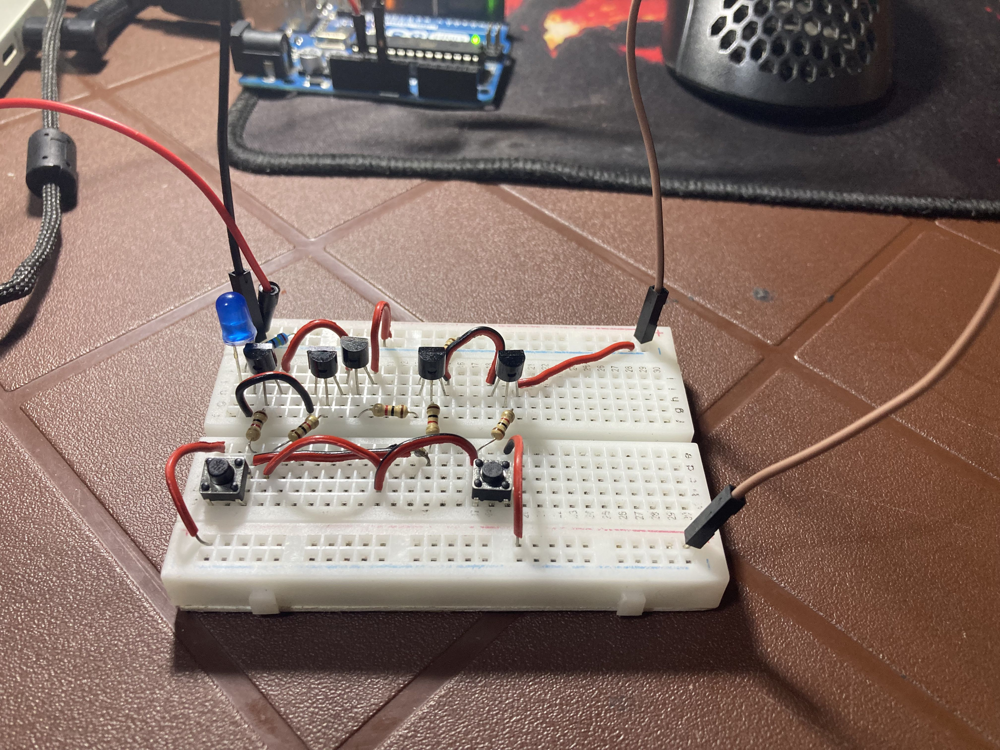

# 👾 8-Bit Computer (Reinventing the Wheel)

<p align="center">
  
</p>


## I- Introduction

This project documents my journey of building an **8-bit computer from scratch**, intentionally **reinventing the wheel** to deeply understand how computers work at the lowest level.

Instead of relying on existing CPUs or abstractions, I focus on **logic gates, registers, ALU design, control logic**, and how everything connects together to form a working computer.

This repository is as much about **learning and reasoning** as it is about the final result.


## II- Project Overview

The project combines:
- **Electronics simulation** (wiring, components, signals)
- **Digital logic simulation** (gates, registers, buses, control logic)
- **Written documentation** explaining design choices and results

## III- How This Project Is Organized

The project is documented **by days**.

Each day has its own folder containing:
- A `README.md` explaining the work of that day
- Logic simulations
- Electrical schematics
- Images and screenshots

Example structure:


```text
day-01/
├── README.md
├── simulation files/
├── schematic files/
└── images/
```


⚠️ **Note:**  
I may not explain *every single detail* or theory exhaustively.  
The focus is on **core ideas, important design decisions, and practical results**.


## IV- Tools & Software Used

### 🔹 Electrical Simulation
- **Proteus** — for electronic circuit design and simulation

### 🔹 Logic Simulation
- **Digital Logic Simulator** by **Sebastian Lague**  
  Created by GitHub user **@SebLague**

🙏 Special thanks to **Sebastian Lague** for creating and sharing this excellent educational tool.

GitHub: https://github.com/SebLague

---

This project is a learning experiment, a technical diary, and a personal challenge.

If you are interested in **computer architecture**, **digital electronics**, or **building computers from first principles**, I hope you find this repository useful.
